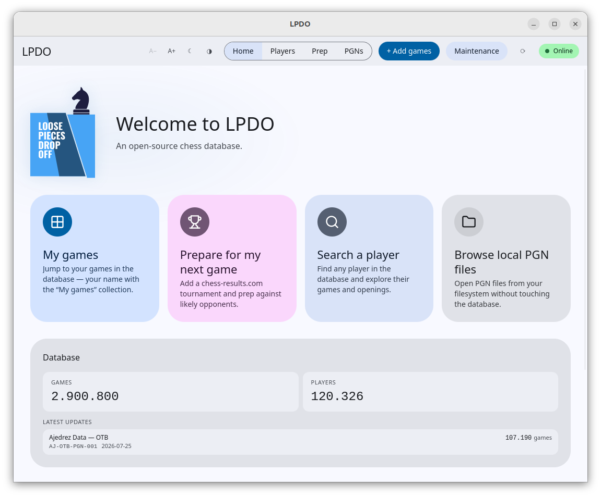
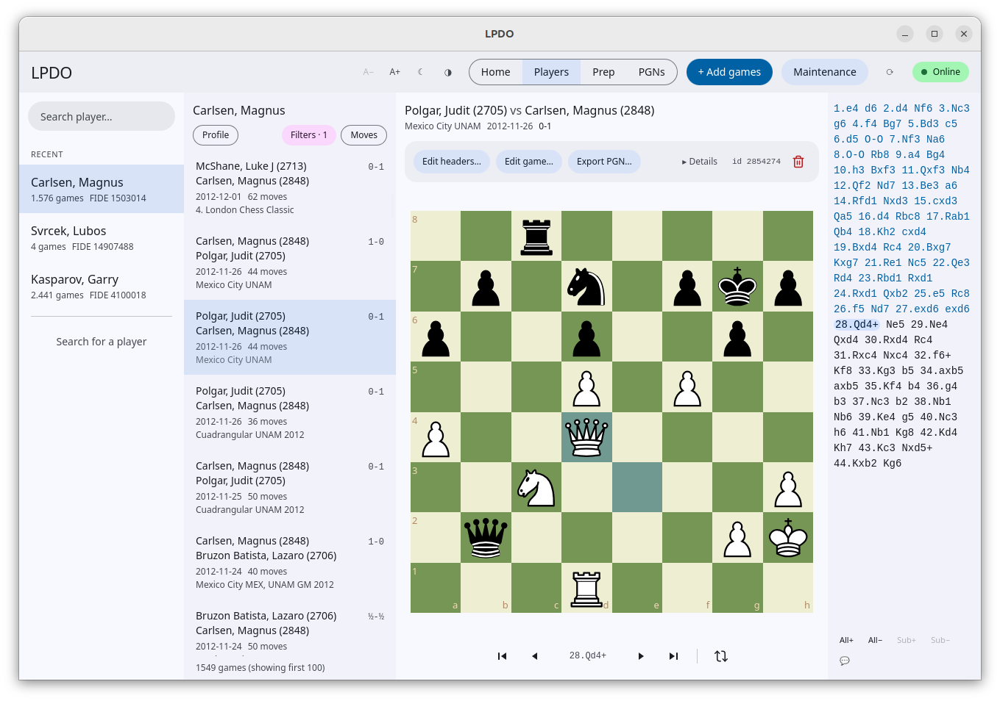
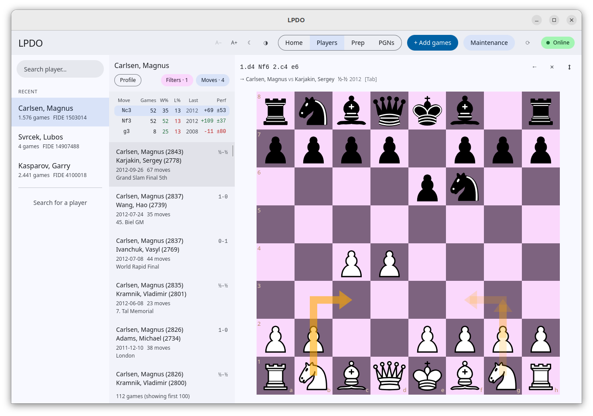

<h1 align="center">LPDO</h1>

<p align="center">
  <strong>A free, open-source desktop chess database.</strong><br>
  Your games, your opponents, your preparation — on your own machine.
</p>

<p align="center">
  <a href="https://github.com/specure/lpdo/releases/latest"></a>
  <a href="LICENSE"></a>
  
  
</p>

<p align="center">
  
</p>

---

LPDO is built around two things a competitive player does:

1. **Manage your own database of your own games** — import your PGNs, keep them
   clean and de-duplicated, normalise player names against the official FIDE
   list, and explore your results and statistics over time.
2. **Prepare for tournaments** — research an upcoming opponent, pull in their
   recent games, and study what you will be facing.

Around those two pillars it keeps a **reference database** current from public
sources. Everything runs locally: your data stays on your machine.

> **Status:** active development. Linux is the primary supported platform today.
> Grab the newest build from the
> [latest release](https://github.com/specure/lpdo/releases/latest), and see the
> [changelog](CHANGELOG.md) for what's new in each version.

## Highlights

### Browse games

<p align="center">
  
</p>

Search a player, filter their games, and step through any of them with the
score alongside the board. Edit headers, fix a game, or export it back out as
PGN. Light and dark themes, adjustable text size, and a board that keeps up
with fast clicking through hundreds of moves.

### See what your potential opponents play

<p align="center">
  
</p>

Walk the opening tree move by move. Each candidate move shows how often it was
played, the win/loss split, when it was last used and the performance rating —
and the game list underneath narrows to exactly the games that reached that
position. This is the tournament-prep loop: pick your opponent, follow their
repertoire, find the branch they are least comfortable in.

### A reference database that keeps itself current

Your opponent's games from last weekend should already be there when you sit
down to prepare. LPDO pulls from several public archives — **The Week in
Chess**, **Lichess Broadcasts** and **Ajedrez Data (OTB)** — each behind its own
switch. It checks them on a schedule you choose, de-duplicates the overlap
between them automatically, and reports progress on long syncs without blocking
the rest of the app. The home screen shows what came in and when.

## Features

**Manage your own games**

- **Import** games from PGN files into a local database, including compressed
  archives (`.zip`, `.zst`, `.7z`).
- **De-duplicate** a collection, with a readable log of exactly which games were
  removed and which copy was kept.
- **Normalise player names** against the official FIDE player list, so the same
  player isn't split across spelling variants — and assign FIDE IDs to players
  from FIDE-less sources by name (see [Player-name normalisation](#player-name-normalisation)).
- **Player profiles & statistics**, including a personalised home screen scoped to
  your own games.
- **Backup** your private "My games" collection to a timestamped PGN file.

**Prepare for tournaments**

- **Match preparation** against an upcoming opponent — look them up, pull their
  recent games, and study what you'll be facing.
- **Opening tree** over any position, with game counts, scores and performance.
- **Position search** across the whole database, backed by a position index.

**Keep it current**

- **Multiple reference sources** (TWIC, Lichess Broadcasts, Ajedrez Data), each
  toggled on or off independently — see the acknowledgements below.
- **Scheduled feed checks** at a time you choose, with a missed check (machine
  off) picked up at the next start.
- **Automatic maintenance** — dedup, indexing and name resolution run as part of
  a sync instead of being chores you have to remember.

## Install

Download from the [latest release](https://github.com/specure/lpdo/releases/latest):

| Platform | Package |
|----------|---------|
| **Linux** | `lpdo_<version>_amd64.deb` (desktop app), `lpdo-server_<version>_amd64.deb` (background server), `lpdo-cli_<version>_amd64.deb` (`chess-db` CLI) |
| **Windows** | `LPDO_<version>_x64-setup.exe` (installer, includes the server as a Windows service) |
| **macOS** | `LPDO_<version>_aarch64.pkg` (Apple Silicon) |

On Linux the desktop app is a thin client — install **`lpdo-server`** as well
(or run `chess-db serve` yourself) so there is a database for it to talk to.

## Architecture

LPDO is a client/server application:

- The **server** (`chess-db serve`) is the sole owner of the DuckDB database,
  for both reads and writes. Every long-running mutation — import, download,
  dedup, index, normalise, backup — runs in-process as a job that streams its
  progress, and an in-process scheduler drives the daily feed checks.
- The **desktop client** is a [Tauri](https://tauri.app/) app (React/TypeScript
  front end, Rust back end) that holds no database handle at all and talks to
  the server over HTTP.

Consolidating all database access into one process is what makes "import while
you keep querying" possible — [DuckDB](https://duckdb.org/) locking is
per-process. See
[docs/client-server-architecture.md](docs/client-server-architecture.md) for
the full design note.

### Repository layout

This is a Cargo workspace plus a Tauri app:

| Path | What it is |
|------|------------|
| `chess-client/`            | The Tauri desktop app — React/TypeScript front end (`src/`) and Rust back end (`src-tauri/`). |
| `chess-db/`                | The database engine: a Rust binary used both as the CLI and as the server (`chess-db serve`). |
| `fide-client/`             | Library for live FIDE profile lookups (rating history, recent games, activity) used by the desktop app. |
| `chess-results-client/`    | Library for fetching tournament data from chess-results.com. |
| `packaging/`               | `.deb` (nfpm), systemd units and installer scripts. |

## Building from source

### Prerequisites

- **Rust** (stable) — <https://rustup.rs/>
- **Node.js** 18+ and **npm**
- **Tauri system dependencies** for your OS — see the
  [Tauri prerequisites guide](https://tauri.app/start/prerequisites/). On
  Debian/Ubuntu this is roughly `webkit2gtk`, `librsvg`, `build-essential`, and
  related `-dev` packages.

### Run the app (development)

```bash
# 1. Build and start the server (it owns the database)
cargo run -p chess-db --release -- serve

# 2. In another terminal, launch the desktop client with hot-reloading
cd chess-client
npm install
npm run tauri dev
```

### Production build

```bash
cd chess-client
npm run tauri build
```

### Use chess-db on its own

`chess-db` is a normal CLI and can be run without the GUI:

```bash
cargo run -p chess-db --release -- --help
```

Set `LPDO_DATA_DIR` to relocate the database, downloads and backups away from
the default `~/.chess-db`.

## Design notes

Longer-form design documents for planned or in-progress work live in
[`docs/`](docs/):

- [Client/server architecture](docs/client-server-architecture.md) — why the
  server owns the database, and how jobs and the scheduler fit around that.
- [Multiple reference-database sources](docs/multi-source.md) — how LPDO
  supports several reference sources behind a common provider abstraction, using
  collections as provenance and deduplication for cross-source consistency.
- [Running the server on another machine](docs/remote-server.md) — putting the
  database on one computer and using it from LPDO on others over the local
  network, with the access token that guards it.

## Player-name normalisation

The same player often appears under slightly different spellings — accents,
punctuation, `Lastname, F.` vs `Lastname, Firstname`. LPDO reconciles them against
the **official FIDE player list**, which the server downloads and stores locally
(~1.9M players) and refreshes periodically. It's all local: no per-player web
scraping, and no external cache service.

- **Forward** (`chess-db players normalise`) — for players that already carry a
  FIDE ID, set the name to the FIDE-canonical spelling. A local join, instant.
- **Reverse** (`chess-db players resolve-fide`) — for FIDE-less sources, assign a
  FIDE ID by matching the name against the list. Only a **single exact match**
  (after folding accents/punctuation) is accepted; ambiguous names are left alone
  rather than guessed. Note the inherent limit: a source without FIDE IDs can only
  identify players by name, so distinct people who share a name are treated as one.

Run `chess-db fide refresh` to fetch or update the list; the server also does this
as scheduled maintenance.

## Acknowledgements

LPDO downloads and imports data from public chess archives that other people
maintain, often for free and for decades:

- **[The Week in Chess](https://theweekinchess.com/)** — published weekly since
  1994 by **Mark Crowther**. A free, invaluable, independent resource that this
  feature relies on. The app asks you to review TWIC's terms — and consider
  supporting Mark's work — before downloading. Please do.
- **[Lichess Broadcasts](https://database.lichess.org/)** — over-the-board
  tournament games relayed live on Lichess and packaged monthly (CC BY-SA 4.0).
- **[Ajedrez Data — OTB](https://ajedrezdata.com/)** — a free public-domain
  archive of over-the-board games, used as the deep historical base.

## License

Licensed under the **Apache License, Version 2.0**. See [LICENSE](LICENSE) and
[NOTICE](NOTICE) for details.

Copyright 2026 Specure. "LPDO" is a trademark of Specure; the Apache-2.0 license
does not grant rights to the LPDO name or logo.
