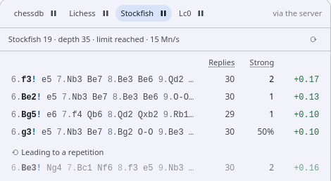
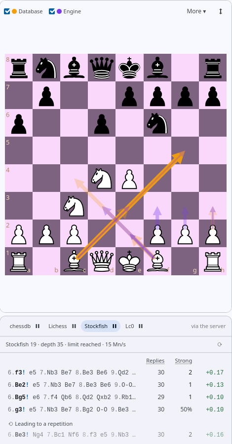

# Installing a chess engine

The Engine panel's **Local** analysis uses a chess engine installed on the
machine the LPDO server runs on. LPDO does not ship one: the strongest free
engine, [Stockfish](https://stockfishchess.org), is GPL-licensed, so you install
it yourself — the way ChessBase lets you add Stockfish beside Fritz. Any engine
that speaks the UCI protocol works; Stockfish is the one described here.

**Which machine?** The one running the LPDO server.

- **Everything on one computer** (the usual desktop install, with the database
  server ticked in the installer): install the engine on that computer.
- **Server on another machine** (see [remote-server.md](remote-server.md)):
  install it on the server. The client computers need nothing.

Maintenance → *Others* → **Chess engine** shows which engine the server uses.
When there is none, the Engine panel's **Local** tab lists where the server
looked.

## Linux

The simplest route is the distribution's package:

```
sudo apt install stockfish        # Debian, Ubuntu, Mint
sudo dnf install stockfish        # Fedora
sudo pacman -S stockfish          # Arch
```

Distribution packages can be several releases behind. Ubuntu 24.04, for
example, ships Stockfish 16 (2023), while the current release is 19. LPDO
checks for the newest Stockfish once a day and shows a notice when the server
runs an older one.

**For the newest release**, install the official build next to the package:

1. Download **Linux x86-64** (or **ARM64**) from
   [stockfishchess.org/download](https://stockfishchess.org/download/), or
   `stockfish-linux-x86-64-universal.tar.gz` from the
   [GitHub releases](https://github.com/official-stockfish/Stockfish/releases).
   The *universal* build picks the fastest instruction set the processor has.
2. Unpack it and install the program as `/usr/local/bin/stockfish`:

   ```
   cd /tmp && tar xzf ~/Downloads/stockfish-linux-x86-64-universal.tar.gz
   sudo install -m 755 /tmp/stockfish/stockfish-linux-x86-64-universal /usr/local/bin/stockfish
   ```

3. Check it runs: `/usr/local/bin/stockfish bench` ends with a
   `Nodes/second` line.

The server looks in `/usr/local/bin` before the package locations, so the new
build is used from then on. If no engine was running, nothing else is needed.
If an older one was, choose the new one under Maintenance → Chess engine, or
restart the server: `sudo systemctl restart lpdo-server`.

## macOS

With [Homebrew](https://brew.sh):

```
brew install stockfish
```

Homebrew keeps it current (`brew upgrade stockfish`). It installs to
`/opt/homebrew/bin` on Apple silicon and `/usr/local/bin` on Intel Macs; the
server looks in both.

## Windows

1. Download **Windows x86-64** from
   [stockfishchess.org/download](https://stockfishchess.org/download/). The
   *AVX2* build runs on most processors made since about 2013; if it will not
   start, take the plain x86-64 build.
2. Unpack the zip. It contains a program named like
   `stockfish-windows-x86-64-avx2.exe`.
3. Create the folder `C:\Program Files\Stockfish` and copy the program there,
   **renamed to `stockfish.exe`**. This takes an administrator account.

The server finds `C:\Program Files\Stockfish\stockfish.exe` by itself.

## Checking

Open the Engine panel on the Analysis page and choose **Local**. It shows the
engine's name, the depth and the speed, and lines that deepen as you watch; if
it still says *No chess engine on the server*, press **Check again**.
Maintenance → Chess engine shows the same, and lets you choose between several
installed engines and set their threads and hash.

## An engine somewhere else

The server finds engines in `$PATH` and in the standard locations above. For an
engine elsewhere, name it in `engine.json` in the server's data directory:

| Platform | File |
|---|---|
| Linux | `/var/lib/lpdo/.chess-db/engine.json` |
| macOS | `/Library/Application Support/LPDO/engine.json` |
| Windows | `C:\ProgramData\LPDO\engine.json` |

```json
{ "path": "/opt/engines/stockfish" }
```

On Windows, double the backslashes: `{ "path": "D:\\Engines\\stockfish.exe" }`.
Then restart the server.

This file on the server is the only way to name an arbitrary program. The
client can choose only among the engines found in the standard locations:
anyone who can reach the server could otherwise make it run any program.

On Linux the server runs as a system service that cannot see home directories,
so keep the engine outside `/home` — `/usr/local/bin` or `/opt` work.

## Switching engines on and off

Maintenance → **Engines** sets each engine. Stockfish and Lc0 are **Auto** or
**Off**: on Auto, the default, the server uses an engine when it is installed —
Lc0 with a network — and picks it up when you install it later, without a
restart; Off, it is never used. chessdb.cn and Lichess, the cloud engines, have
an on/off switch. An engine not in use leaves the Engine panel, and the server
neither runs nor asks it — Lc0 then holds no graphics memory. LPDO checks once a
day for new releases of the Stockfish and Lc0 in use, and shows a notice when
the server runs an older one.

## Settings

| Setting | Default | |
|---|---|---|
| Threads | one per physical core, less the helpers' | A core's second hardware thread adds little to Stockfish, and the server also answers everyone's queries while it analyses. |
| Hash | an eighth of the memory, 256 MB – 4 GB | More keeps more of an analysis when you move on and come back. |
| Lines | 5 (Lc0: 10) | 1–20, set per computer. Each extra line makes Stockfish search a little slower; Lc0 reports its lines from one search at no cost. |

**Memory is one budget.** The server may use 80% of the machine's memory. The
engine's hash comes out of it and the database gets the rest, keeping at least
2 GB — on a 32 GB machine, 4 GB of hash leaves the database about 21 GB. The
card shows the split as you type; saving applies it to both at once. Less hash
leaves the database more room for large jobs such as removing duplicates,
which slow down (they spill to disk) rather than fail when memory is short.

Maintenance → Chess engine → **Benchmark** runs Stockfish's own benchmark
(depth 16) with the threads and hash set there, and keeps the results in a
table: change a setting and run again to compare. Compare the **speed**: with
several threads the time varies from run to run (8 and 16 seconds for the same
settings on one machine), and hash hardly shows in a benchmark. One run is
marked *recommended*: at most one thread per physical core, and of those the
fewest threads that reach 80% of the fastest; **Use** sets it.

A search stops when you move to another position or close the panel, or when it
reaches its threshold, set per engine under Maintenance: **depth 35** for
Stockfish, and **2 million nodes** for Lc0 — Lc0's "depth" is only the average
length of the lines it explores, so nodes are its measure. There is always a
threshold; **⟳** in the Engine panel then searches further (Stockfish five
plies deeper, Lc0 as many nodes again), also while the search still runs. It
goes on from where the search got: Lc0 keeps its search tree, and on Linux and
macOS the server freezes Stockfish at its depth rather than ending the search
(a frozen process uses no processor), so the search continues — until you move
to another position, which the engine is needed for. **Pause** on the engine's
tab freezes Stockfish's search the same way, and **Run** on the same position
goes on from there. On Windows Stockfish
starts again, its hash making the first depths quick. While a search runs the panel tells
the server every 15 seconds that it is still open; when it has not for three
minutes — the computer went to sleep, say — the server stops the search.

While the panel shows a remembered result, deeper than the new search has got,
its header also says how far the new search is ("searching: depth 22").

## Lines that lead to a repetition

Stockfish can rate a move better than a draw while its line, played out,
comes back to a position already on the board — from earlier in the line, or
from the game before it: the moves just shuffle, and at the repetition the
better side would have to find another, more principled way to make progress.
Where the side to move is better — by more than 0.00 in the best line, so
any advantage — the Engine panel shows such lines apart, below the principal
ones, under **⟲ Leading to a repetition**, greyed; the tooltip says at which
move the position repeats. They get no arrow on the board. Maintenance →
Engines → Stockfish switches this off (*Show non-principal lines
separately*) or sets the advantage it needs, per computer.

<p align="center">
  
</p>

Here 6.Be3 rates +0.16, but after 6…Ng4 7.Bc1 Nf6 the position is back
where it was: the principal moves are the four above.

## Arrows on the board

The boards on the Games and Analysis pages draw the most played and the
strongest moves, each with a checkbox above the board (per page, per
computer):

- **Database** (orange): the most played moves from the position — as many as
  cover three quarters of its games, thicker for a larger share. One arrow
  where a move dominates; many thin ones where play is spread and there is no
  favourite.
- **Engine** (violet): every move any engine with a result for the position
  marks **!** — chessdb.cn, Lichess, Stockfish and Lc0 together — stronger
  the more of them agree. Stockfish's lines that lead to a repetition get
  none.

Where a move is both, the violet arrow is drawn thinner inside the orange
one: a popular move no engine rates strong shows orange alone, and a strong
move that is rarely played violet alone. While a game has arrows of its own
(from its PGN), these are drawn fainter.

<p align="center">
  
</p>

After 5…a6 in the Najdorf, the five most played moves (6.Bg5, 6.Be3,
6.Be2, 6.Bc4, 6.h3) cover three quarters of the games and get orange
arrows; Stockfish's strong moves 6.f3, 6.Be2, 6.Bg5 and 6.g3 get violet
ones — and 6.Be3, whose line repeats, none.

## Kept results

Every position Stockfish or Lc0 analyses keeps its furthest result — in the
database, so it outlives a restart of the server or the app, and it is there for
everyone who uses the server. Coming back to a position shows it at once, and
the engine deepens it from there.

Results are kept per engine version: Stockfish 19 and 20, or Lc0 with another
network, judge positions differently. After an upgrade, a position the new
version has not analysed yet shows the older version's result, greyed and
labelled ("from Stockfish 19"), until the new one has its own; the marks and
strong-reply counts of the positions before it use only the version in use.
Maintenance → Engines → **Kept engine results** lists them per version, with the
room they take, and deletes an old version's. A result takes about 1–2 kB.

## Replies & Strong

As chessdb.cn does, the Engine panel can show for each candidate move how many
replies the opponent has and how many of them are **strong** — close to the
best. Few strong replies means a forcing move. The replies are the legal moves,
shown at once. The strong ones are counted by helper processes of the same
engine once the main search has settled (Stockfish from depth 16, Lc0 from
100,000 nodes); while a candidate is counted, the Strong column shows how far
it has got, and "…" while it waits for a free helper.

- **Stockfish** (on by default): each helper is a single-threaded Stockfish
  that searches the position after one candidate — its best five replies —
  to a set depth (24). By default there are 5 helpers, as many as the lines
  shown, so all are counted at once, and the main search gets the physical
  cores less these: 11 + 5 on a 16-core machine. The helpers share 320 MB of
  hash, out of the same memory budget. A reply is strong within 0.10 pawns of
  the best (chessdb uses 0.05). Five replies are enough for what the column is
  for — the moves with only one or two good answers: the count is exact up to
  four, and **5+** (five or more) beyond. A candidate takes about 5 s, where
  every reply to depth 20 took 11–13 s. The helper's lines are kept like any
  result of the position (see *Kept results*), so the counts outlive a
  restart, and a new "Strong within" applies to them at once, without
  counting again.
- **Lc0** (off by default: its helper loads a second copy of the network onto
  the card): one helper runs a short search per candidate (50,000 nodes, well
  under a second on an RTX 4090) counting the replies it explored within 1% of
  expected score of the best.

**Marks.** The same threshold marks the moves: a move within it of the best
is **!** — so a move marked **!** is one of the strong replies counted for the
move before it. A second threshold, **Neutral within**, leaves the moves a
little further behind unmarked; those further still are **?**. Each engine has
its own pair: Stockfish 0.10 and 0.30 pawns, Lc0 1% and 3% of expected score,
Lichess 0.05 and 0.15 pawns (with the cloud engines). chessdb.cn marks its moves
and counts its strong replies by its own rule, which LPDO cannot change.

**Deeper analyses count.** When you play a move and the engine analyses the
position after it more deeply than the helpers do (Stockfish beyond their
depth, Lc0 beyond their nodes), going back shows that analysis for the move:
its evaluation and line (the tooltip on the evaluation says how deep), the
order and marks of the moves by it, and its strong replies — those among its
lines within the threshold, exactly as the marks after the move show them.
When all its lines are strong there may be more; the count then shows a lower
bound such as "5+", or the helper's count if that is higher.

All of it is set in the engine's card on Maintenance → Engines.

## Measuring speed

`stockfish bench` searches a fixed set of positions and prints the nodes
searched and the speed. With the server's settings:

```
stockfish bench 256 8 20     # hash MB, threads, depth
```

With the defaults (`stockfish bench`: one thread) the node count identifies the
Stockfish build — the same build gives the same number on every machine — and
only the speed depends on the hardware. With several threads the count varies
from run to run. Compare speeds between machines for the same version only: a
newer Stockfish that searches fewer nodes is not a weaker engine.

## Leela Chess Zero

[Lc0](https://lczero.org) is the second engine, beside Stockfish, in the Engine
panel's **Lc0** tab. It judges a position with a neural network and gives its
chances as **win · draw · loss** from White's side — "21·63·17" — rather than
centipawns. It is optional, because it needs a graphics card to be fast.

Measured on one machine (the network's raw speed, positions per second, with
`lc0 backendbench`; a real search is somewhat faster, from its cache):

| Hardware | Backend | Network | Positions/s |
|---|---|---|---|
| NVIDIA RTX 4090 (external, Thunderbolt 3) | `cuda-fp16` | t3-512x15x16h | ~20,000 |
| NVIDIA RTX 4090 | `cuda-fp16` | T1-256x10 | ~47,000 |
| AMD Radeon 8060S (integrated) | `opencl` | 42850 (20×256) | ~580 |
| 16-core processor | `eigen` | T1-256x10 | ~130 |

With an NVIDIA card it is a real second opinion; without a graphics card it is
too slow to be useful. Mesa's OpenCL on an AMD graphics chip works but is slow,
and runs only Lc0's older networks.

It needs two things on the server: **the program** and **a network file**.

### The program

- **Windows:** download it from [lczero.org](https://lczero.org/play/download/) —
  the CUDA build for an NVIDIA card, the *onnx-dml* build for any other — and
  put `lc0.exe` in `C:\Program Files\Lc0`.
- **macOS:** `brew install lc0`.
- **Linux:** Lc0 publishes no Linux download; it is built from source. For an
  NVIDIA card:

  1. The driver and CUDA. On Ubuntu the driver's kernel modules come prebuilt
     and signed, so Secure Boot needs no extra step:

     ```
     sudo apt install nvidia-driver-595-open linux-modules-nvidia-595-open-generic-hwe-24.04
     sudo reboot
     nvidia-smi                        # lists the card
     sudo apt install nvidia-cuda-toolkit
     ```

  2. Build Lc0 (it needs `meson`; its Python package, or the release archive
     from mesonbuild's GitHub run as `python3 meson.py`). `-Dcc_cuda=89` is the
     RTX 40 series; 86 is the 30 series, 75 the 20 series:

     ```
     git clone --depth 1 --branch v0.32.1 --recurse-submodules https://github.com/LeelaChessZero/lc0.git
     cd lc0
     meson setup build-cuda --buildtype=release -Dplain_cuda=true -Dcudnn=false -Dcc_cuda=89 \
       -Dopencl=false -Dblas=false -Donnx=false -Dgtest=false
     ninja -C build-cuda lc0
     sudo install -m 755 build-cuda/lc0 /usr/local/bin/lc0
     ```

  A driver upgrade that brings a new CUDA version may need the build repeated.

### A network

Download one from [lczero.org → Networks](https://lczero.org/play/networks/bestnets/)
and put the `.pb.gz` file in the server's `networks` folder:

| Platform | Folder |
|---|---|
| Linux | `/var/lib/lpdo/.chess-db/networks/` |
| macOS | `/Library/Application Support/LPDO/networks/` |
| Windows | `C:\ProgramData\LPDO\networks\` |

A medium network such as **t3-512x15x16h** suits a modern card; a small one
such as T1-256x10 is quicker on a weaker one. On Linux:

```
sudo install -d -o lpdo -g lpdo /var/lib/lpdo/.chess-db/networks
sudo install -m 644 -o lpdo -g lpdo t3-512x15x16h-distill-swa-2767500.pb.gz /var/lib/lpdo/.chess-db/networks/
```

The server also finds networks beside the program. Maintenance → *Others* →
**Lc0** chooses among the programs and networks found, the backend (automatic
by default) and the search threads (0 lets Lc0 choose: its work is on the
graphics card). Another network file can be named in `lc0.json` beside
`engine.json`, as `{ "weights": "/path/to/net.pb.gz" }`.

**Smart pruning** — Lc0 ending a search once its best move cannot be
overtaken — is off by default: the Engine panel shows several lines, and with it
on the second and third stop improving as soon as the first is settled. Switch
it on to have only the best move, or to spare the card.

**Benchmark:** the Lc0 card runs Lc0's standard `lc0 benchmark` — 34 positions,
ten seconds each, about six minutes — with the program, network and backend set
there. Only the full run is comparable between machines: Lc0 gets faster as each
search goes on (on an RTX 4090, 62,000 nodes/s for the standard run against
12,000 with three seconds a position, and 6,400 for `lc0 bench`).

The Linux service can use an NVIDIA card as installed: its device files are
open to every user, and the service's home, where CUDA keeps compiled kernels,
is writable.
